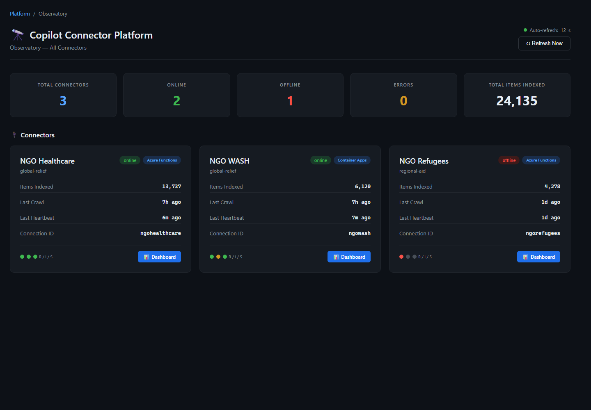
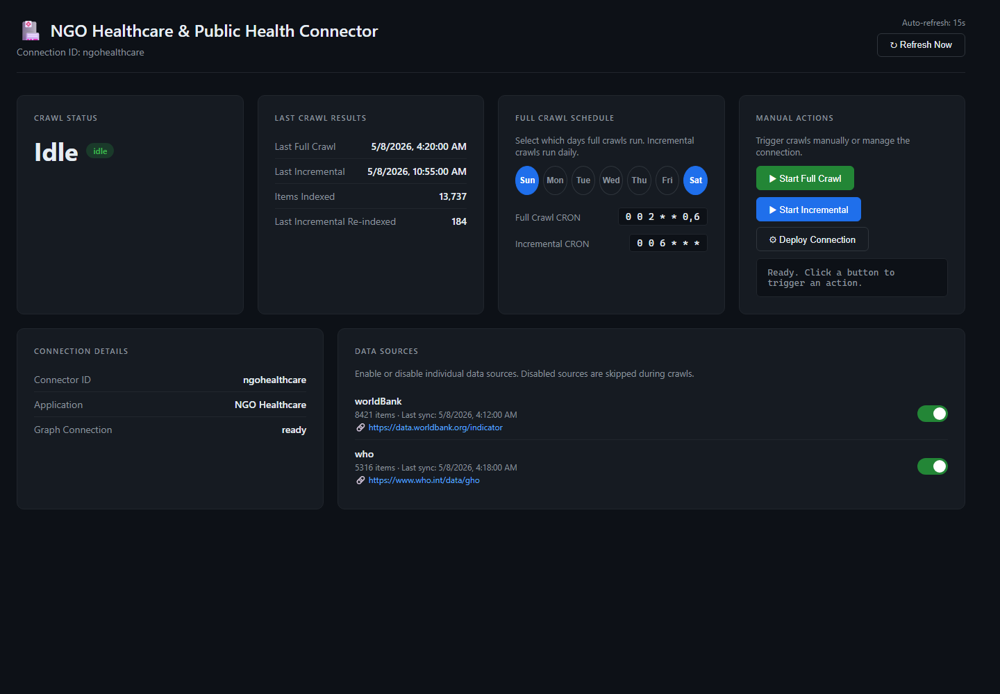

# NGO Connectors

A suite of **16 Microsoft 365 Copilot Connectors** that ingest publicly available NGO and international development data into the Microsoft Graph semantic index, plus the supporting hosting platform, deployment tooling, and evaluation pipeline.

Each connector targets one humanitarian / development sector, normalizes data from authoritative public sources (World Bank, OWID, WHO, UNHCR, IFRC, etc.) into a sector-specific schema, and exposes that data to Microsoft 365 Copilot, Microsoft Search, and Context IQ through one Microsoft Graph external connection per sector.

---

## Repository layout

```
NGO_Connectors/
├── ngo-agriculture/      ┐
├── ngo-aidfunding/       │
├── ngo-childprotection/  │
├── ngo-conflict/         │
├── ngo-economics/        │
├── ngo-education/        │
├── ngo-energy/           │  16 sector-specific Copilot Connectors
├── ngo-environment/      │  (Azure Functions / Container Apps)
├── ngo-gender/           │
├── ngo-healthcare/       │
├── ngo-humanitarian/     │
├── ngo-humanrights/      │
├── ngo-multisector/      │
├── ngo-nonprofit/        │
├── ngo-refugees/         │
├── ngo-wash/             ┘
│
├── platform/             # Multi-tenant control-plane API (Express + Cosmos DB)
├── agent-packages/       # Built Teams/M365 app packages for the declarative agents
├── plans/                # Per-sector data plans + NGO_INDUSTRY_DATA.md catalog
├── setup/                # Deployment scripts and .env templates
│
├── data/                 # Local mirror of every connector's source data (gitignored)
├── download_data.mjs     # Fetches raw data from every connector's external APIs
├── flatten_data.mjs      # Unwraps wrapped JSON responses for eval-gen consumption
├── run_evalgen.ps1       # Runs eval-gen across all connectors (default size)
├── run_evalgen_lg.ps1    # Runs eval-gen across all connectors (large evalsets)
└── bugs_enhancements.md  # Audit notes and connector-by-connector findings
```

---

## The 16 connectors

Each connector lives in its own directory and is independently deployable. They share a common shape: an Azure Functions / Container Apps host, a sector-specific Microsoft Graph schema, periodic crawls, and a declarative Copilot agent.

| Connector | Sector | Primary data sources |
|-----------|--------|----------------------|
| **ngo-agriculture** | Agriculture, food security | World Bank WDI, OWID, FAOSTAT |
| **ngo-aidfunding** | Aid transparency, ODA flows | World Bank ODA indicators, IATI Registry |
| **ngo-childprotection** | Child welfare, mortality, labor | World Bank WDI, OWID datasets |
| **ngo-conflict** | Armed conflict, crime, violence | World Bank WDI, ACLED*, UCDP*, UNODC* |
| **ngo-economics** | GDP, poverty, inequality | World Bank WDI, UNDP HDI, OWID |
| **ngo-education** | Enrollment, literacy, attainment | World Bank WDI, OWID datasets |
| **ngo-energy** | Energy access, renewables | World Bank WDI, OWID Energy Data |
| **ngo-environment** | Emissions, forests, biodiversity | World Bank WDI, OWID CO2, EM-DAT* |
| **ngo-gender** | Gender equality | World Bank WDI, OWID API |
| **ngo-healthcare** | Public health, mortality, immunization | WHO Global Health Observatory, World Bank |
| **ngo-humanitarian** | Crises, appeals, response | HDX (CKAN), IFRC GO, ReliefWeb* |
| **ngo-humanrights** | Governance, corruption, freedom | World Bank WGI, Freedom House*, Transparency International* |
| **ngo-multisector** | Cross-cutting SDG indicators | World Bank WDI, OWID |
| **ngo-nonprofit** | US/UK nonprofit registers | ProPublica Nonprofit Explorer, UK Charity Commission* |
| **ngo-refugees** | Displacement, migration | UNHCR Population API, World Bank migration |
| **ngo-wash** | Water, sanitation, hygiene | World Bank WDI, OWID (WHO/UNICEF JMP) |

`*` Sources marked with an asterisk require either a registered API key or a manually-exported CSV/XLSX placed in the connector's `state/` directory. See each connector's `README.md` for details.

### Anatomy of one connector

```
ngo-<sector>/
├── declarativeAgent.json   # Copilot declarative agent definition
├── deploy.ps1              # Interactive deployment wrapper
├── Dockerfile              # Azure Functions Node 20 container image
├── host.json               # Azure Functions host config (4-hour timeout for crawls)
├── local.settings.json     # Local-dev settings (gitignored)
├── package.json            # Node 20, TypeScript build
├── README.md               # Sector-specific documentation
├── tsconfig.json
└── src/
    ├── config/             # Connection metadata + Graph schema
    ├── dataSources/        # Per-source fetch + normalize (e.g. worldBank.ts, owid.ts)
    ├── functions/          # HTTP triggers: provision, fullCrawl, incrementalCrawl,
    │                         heartbeat, health, dashboard
    ├── services/           # Graph client, batch ingestion, platform reporting
    ├── state/              # Crawl checkpoints and local source-file uploads
    ├── summaries/          # Pre-computed summary items
    └── transform/          # Content building, ACL, normalization
```

Every connector exposes the same HTTP surface:

| Endpoint | Trigger | Purpose |
|---|---|---|
| `POST /api/provision` | HTTP | Create the Graph connection and register the schema |
| `POST /api/fullCrawl` | HTTP / monthly timer | Re-ingest every source from scratch |
| `POST /api/incrementalCrawl` | HTTP / weekly timer | Detect and ingest only changed records |
| `GET  /api/health` | HTTP | 3-layer health check (config, Graph reachability, last crawl) |
| `GET  /api/dashboard` | HTTP | Per-source counts, last sync, errors |
| `POST /api/heartbeat` | HTTP / interval timer | Self-register with the platform control plane |

---

## Quick start — run one connector locally

```powershell
cd ngo-wash
npm install
Copy-Item .env.example .env
# Edit .env with TENANT_ID, CLIENT_ID, CLIENT_SECRET (Entra ID app
# with ExternalConnection.ReadWrite.OwnedBy + ExternalItem.ReadWrite.OwnedBy)
npm run build
func start

# in another shell
curl -X POST http://localhost:7071/api/provision
curl -X POST http://localhost:7071/api/fullCrawl
```

After the crawl completes, the connector appears under **Microsoft 365 admin center → Settings → Search & intelligence → Data sources**, and its content becomes searchable in Microsoft 365 Copilot.

---

## Deploying all connectors

The `setup/` directory contains scripts that drive Azure infrastructure provisioning, Function App / Container Apps deployment, and Microsoft Graph connection provisioning end-to-end.

```powershell
Copy-Item .\setup\.env.template .\setup\.env
# Fill in AZURE_TENANT_ID, AZURE_SUBSCRIPTION_ID, MICROSOFT_TENANT_ID, etc.

# Plan (no changes)
.\setup\deploy-connectors.ps1 -PlanOnly

# Deploy a single connector
.\ngo-healthcare\deploy.ps1 -EnvFile .\setup\.env -DeployTarget container-app -Provision

# Deploy all 16 connectors and trigger first crawl
.\setup\deploy-connectors.ps1 -EnvFile .\setup\.env -SetAppSettings -Provision -Crawl
```

`DEPLOY_TARGET` can be `azure-functions` (Linux App Service Plan) or `container-app` (Azure Container Apps). Existing Azure resources are reused after an interactive prompt; missing resources are created automatically. See [`setup/README.md`](setup/README.md) for the full reference.

---

## Declarative agent packages

Each connector ships with a Copilot **declarative agent** (`declarativeAgent.json`) that turns it into a discoverable, sector-specialized Copilot experience (for example "NGO WASH Analyst", "NGO Healthcare Analyst", etc.). The `agent-packages/` directory contains pre-built `.zip` Teams/M365 app packages — one per connector — plus the build and deploy scripts:

```powershell
.\setup\build-agent-packages.ps1     # Re-generates the 16 .zip packages
.\setup\deploy-agent-packages.ps1    # Uploads to the M365 tenant app catalog
```

App IDs are deterministic (SHA-256 of the connector name) so re-uploads update the existing app instead of creating duplicates.

---

## The hosting platform

`platform/` contains a multi-tenant control-plane API that monitors and operates all 16 connectors. It provides:

- **Tenant lifecycle** — create / deactivate / offboard tenants with plan-based quotas
- **Connector registry** — heartbeat-based self-registration; auto-discovers `ngo-*` directories
- **Schema management** — draft → validate → promote workflow with versioning
- **Upload pipeline** — accept CSV/JSON/JSONL, stage, validate, ingest
- **Observatory** — cross-tenant dashboard, 3-layer health checks, alerts
- **Audit log** — every privileged action recorded
- **Storage** — Cosmos DB in production, local JSON fallback for dev
- **Secrets** — Key Vault in production, local file fallback for dev

```bash
cd platform
npm install
npx tsx src/server.ts        # http://localhost:8080
```

See [`platform/README.md`](platform/README.md) for full API docs.

---

## Managing connectors from the web dashboard

The hosting platform includes browser-based dashboards for operating connectors without calling APIs directly. Start the platform and open the Observatory to review connector health, item counts, last crawl status, tenant ownership, and quick links to each connector dashboard.

| Dashboard | Relative URL | Purpose |
|---|---|---|
| Platform Observatory | `/observatory.html` | Cross-tenant view of all registered and discovered connectors, including runtime / ingestion / search health. |
| Specific connector dashboard | `/api/dashboard` | Per-connector control surface for crawl status, crawl schedule, manual crawl/provision actions, and source enablement. |





---

## Data download and evaluation tooling

Three root-level scripts mirror, normalize, and evaluate every connector's data without touching Azure or Microsoft Graph. This is the workflow used to validate connector behavior and to generate Copilot eval sets.

### 1. Download raw source data

```powershell
node download_data.mjs
# or, for a single connector
node download_data.mjs healthcare
```

`download_data.mjs` mirrors every HTTP call each connector makes — World Bank pagination, OWID CSV downloads, WHO GHO OData, UNHCR populations, HDX CKAN, IFRC GO, ProPublica searches, etc. — and saves the raw JSON / CSV under `data/<connector>/<source>/`. Sources requiring credentials (IATI Datastore, ReliefWeb appname) or manual exports (ACLED, UCDP, UNODC, EM-DAT, Freedom House XLSX, TI CPI XLSX, UK Charity Commission) leave a `NOTE.txt` instead. The script is idempotent.

### 2. Flatten wrapped JSON

```powershell
node flatten_data.mjs
```

`flatten_data.mjs` unwraps the various API envelope shapes (`{meta, data: [...]}` from World Bank, `{value: [...]}` from WHO, `{items: [...]}` from UNHCR, `{result.results: [...]}` from CKAN, ProPublica `pages[].organizations[]`) into flat arrays so each record is one row.

### 3. Generate Copilot evaluation sets

```powershell
.\run_evalgen.ps1                  # standard eval sets → data/<connector>/evalset/
.\run_evalgen_lg.ps1               # large eval sets    → data/<connector>/evalset_lg/
```

Each script invokes the Copilot Evaluation CLI (`eval-gen`) once per source subdirectory and merges the resulting CSVs. The `_lg` variant uses `--count 100`, splits intent generation into row-distinct batches, and batches the drafting LLM calls in groups of 12 to avoid response truncation. Output per connector:

| File | Contents |
|---|---|
| `evalset/eval-set.csv` | Merged questions + expected answers + assertions (CSV format consumed by EvalScore) |
| `evalset/<source>-eval-set.csv` | Per-source partial CSVs |
| `evalset/<source>-eval-set.evalgen.json` | Sidecar with assertions, facts, grounding confidence |
| `evalset/<source>-eval-set-review.md` | Human-readable review document |

---

## Background and design notes

- **`plans/NGO_INDUSTRY_DATA.md`** — the master catalog mapping each NGO sector to its authoritative public datasets, schemas, and field semantics.
- **`plans/01_*.md` … `plans/16_*.md`** — per-sector data plans capturing source URLs, indicator codes, schema decisions, and ACL choices.
- **`platform/PLATFORM_PLAN.md`** — design rationale for the multi-tenant platform.
- **`bugs_enhancements.md`** — audit findings against Copilot Connector best-practice rules: schema validity (≤128 properties, semantic labels, `microsoft.graph.externalItem` baseType), `StringCollection.@odata.type` tags, schema registration polling, 429 retry handling, and per-connector recommendations.

### Architectural choices

- **One Graph connection per sector**, not one tenant-wide connection. Each connector has its own external-items schema tuned to its data shape.
- **Long-running crawls** are pushed to a queue-backed `fullCrawl` worker so HTTP triggers return immediately. Function timeout is set to 4 hours.
- **Per-source `state/` directories** persist crawl checkpoints and accept manually-uploaded CSV/XLSX exports for sources without public APIs.
- **Per-record ACLs** default to `everyone` (public NGO data); switch to `everyoneExceptGuests` when guest users should not see the data.
- **Static sources are downloaded directly**: Freedom House and TI CPI XLSX files are mirrored as binary; FAOSTAT is queried per crop/country/element with conservative rate limiting and a probe-fail-fast guard for the upstream's frequent 521s.

---

## Prerequisites

- **Node.js 20+** for connectors, platform, and tooling
- **PowerShell 7+** for `setup/`, `run_evalgen*.ps1`, and per-connector `deploy.ps1`
- **Azure Functions Core Tools v4** for local development (`func start`)
- **Azure CLI** for deployment scripts
- **Microsoft 365 tenant** with Copilot license and admin access for connector provisioning
- **Entra ID app registration** with `ExternalConnection.ReadWrite.OwnedBy` and `ExternalItem.ReadWrite.OwnedBy` (admin-consented)

For the evaluation pipeline:

- **Copilot Evaluation CLI** (`eval-gen`, `eval-score`) installed globally

---

## Repository conventions

- **Branch**: `main`
- **Line endings**: LF, except `.ps1`/`.cmd`/`.bat` which use CRLF (enforced via `.gitattributes`)
- **Ignored**: `node_modules/`, `dist/`, `bin/obj/`, `.env*` (except `.env.example`), `local.settings.json`, `state/`, `data/`, `*.log`
- **Co-authored commits**: machine-assisted commits include a `Co-authored-by: Copilot` trailer

---

## License and data attribution

The connector code in this repository is for use within the licensed Microsoft 365 environment it is deployed to. The underlying datasets retain their original licenses and attribution requirements:

- **World Bank Open Data** — CC BY 4.0
- **Our World in Data** — CC BY 4.0 (per-dataset)
- **WHO Global Health Observatory** — open access, attribution requested
- **UNHCR Refugee Data Portal** — public domain
- **HDX / IFRC GO / ReliefWeb / IATI** — per-dataset; verify before redistribution
- **FAOSTAT** — CC BY-NC-SA 3.0 IGO
- **UNDP Human Development Reports** — CC BY 3.0 IGO
- **Freedom House / Transparency International** — non-commercial use with attribution
- **ProPublica Nonprofit Explorer** — public IRS Form 990 data
- **UK Charity Commission** — Open Government Licence v3.0
- **ACLED / UCDP / UNODC / EM-DAT** — registered access with usage terms

When redistributing or surfacing this data through Copilot, preserve `sourceOrganization`, `datasetName`, and `dataSourceUrl` on every external item — every connector's normalizer already does this.
